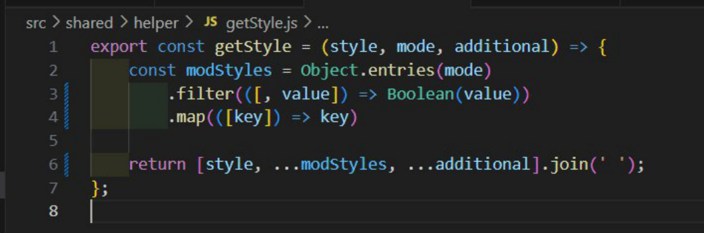
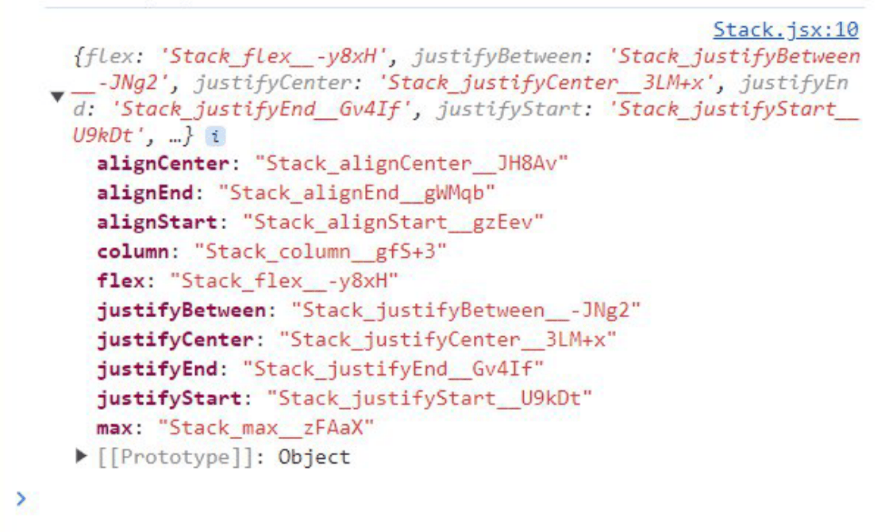
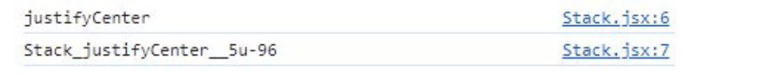
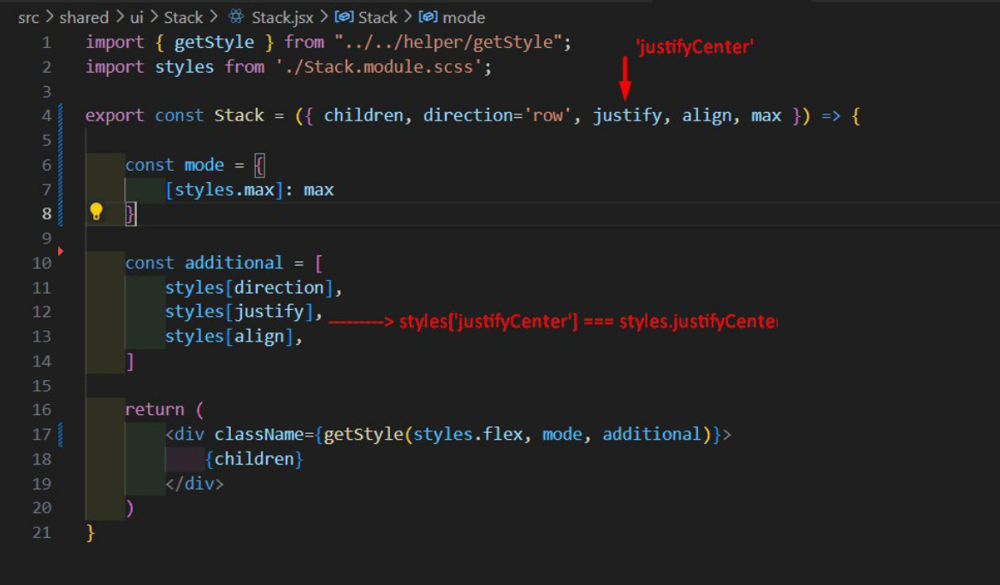
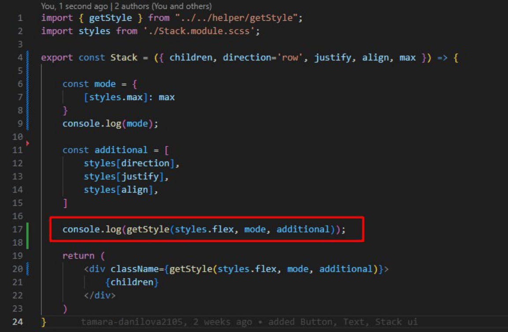
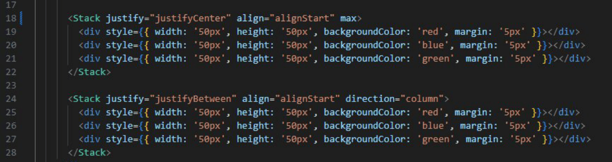

# Функция getStyle

Цель данной функции - вернуть строку для атрибута `className` из всех переданных аргументов при вызове.

## 1) Вызов функции getStyle – строка 17, на примере компонента Stack (компонент, позиционирующий элементы на странице)

## 2) Описание функции
- **Параметры:**
  - `style` – базовый/общий класс компонента;
  - `additional` – массив дополнительных классов – передаваемые пропсом от родительского компонента для уникальной стилизации под дизайн систему и UI;
  - `mode` – стиль, который применяется только, если его состояние `true`.

## 3) Посмотрим в консоли, что из себя представляют переменные `mode` и `additional`:

## 4) Посмотрим в консоли, что такое `styles`:

Это объект со значением:
  - `key` – название стиля в CSS;
  - `value` – его сгенерированное значение модульным CSS.

Данные для формирования объекта берутся из документа SCSS, где название класса является `key` объекта `styles`.

## 5) Еще раз посмотрим на синтаксис переменных `mode` и `additional`:

### 5.1) `const additional`
Подробнее о синтаксисе вы можете ознакомиться здесь: [Объекты (javascript.ru)](https://learn.javascript.ru/object)

Чтобы получить значение по какому-либо свойству, мы можем написать так:

И увидим в консоли следующее – `value` по `key`:

Но мы также можем писать `key` в квадратных скобках, когда ключ состоит из двух слов или это строка.

В данном случае, мы записываем `styles[justify]`, потому что пропс из родительского компонента мы передаем в виде строки.

Пример – пропсом мы передаем значение `justify`, как `‘justifyCenter’`.

В таком случае наша запись на строке 12 будет выглядеть как `styles['justifyCenter']`, что тоже самое что и `styles.justifyCenter`, и мы получим нужное значение объекта `styles`.

### 5.2) `const mode`
Представляет собой объект со свойствами `key` – сгенерированное модульным SCSS значением, здесь `value` `true/false`.

## 6) Результат выполнения функции:

Мы получим данную строку:

При монтировании компонента в DOM-дерево, в процессе рендера страницы, нужные данные из SCSS подтянутся из объекта `styles`, и мы увидим результат.

